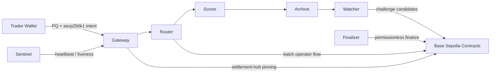

# DARWIN Threat Model

## Executive Summary

DARWIN v1 is a PQ-hardened intent and replay overlay on classical EVM settlement. The highest-risk assets are settlement authorization, bond custody, epoch-root integrity, and operator trust around gateway admission plus watcher replay. The current Base Sepolia canary reduces accidental misconfiguration by pinning deployment artifacts and verifying on-chain auth wiring, but the system still depends on off-chain services for intent verification and archive publication.

This document is repo-grounded. It maps the live trust boundaries to the current implementation in `overlay/`, `sim/darwin_sim/`, and `contracts/src/`.

## Scope And Assumptions

In scope:

- gateway admission and dual-envelope verification in `overlay/gateway/server.py`
- archive publication and mirroring in `overlay/archive/service.py` and `sim/darwin_sim/watcher/archive.py`
- watcher replay and challenge detection in `overlay/watcher/service.py` and `sim/darwin_sim/watcher/replay.py`
- canary/finalization/sentinel flows in `overlay/finalizer/service.py` and `overlay/sentinel/service.py`
- contract state machines in `contracts/src/SettlementHub.sol`, `BondVault.sol`, `ChallengeEscrow.sol`, `EpochManager.sol`, `ScoreRegistry.sol`, `SharedPairVault.sol`, and `SpeciesRegistry.sol`

Assumptions:

- Base Sepolia is the current public deployment target
- `ops/deployments/base-sepolia.json` is the pinned artifact used for canary checks
- live operators follow `docs/OPERATOR_QUICKSTART.md`
- the current alpha still concentrates governance, epoch, batch, and safe-mode roles into one address

Out of scope:

- mainnet custody assumptions
- DRW token activation economics after canary gates
- validator-client or sovereign-consensus threats, because v1 is not a chain

## System Model

## Assets And Security Objectives

| Asset | Security objective |
|---|---|
| Intent authenticity | Only valid PQ + EVM bound intents are admitted |
| Deployment binding | Intents and overlay services target the intended chain and settlement hub |
| Bond custody | Bonds cannot be withdrawn, slashed, or transferred outside policy |
| Settlement authorization | Only authorized actors can submit or settle batches |
| Epoch lifecycle | Epochs cannot be reopened, finalized early, or rooted with malformed data |
| Score integrity | Published roots are non-zero, single-use, and posted only in the right phase |
| Species state | Missing species cannot be mutated into existence |
| Replay integrity | Watchers must detect archive corruption or scoring divergence |
| Operator evidence | Outside operators and reviewers can inspect the same pinned deployment and canary state |

## Trust Boundaries

### Trader wallet -> Gateway

- Intent creation and verification live in `sim/darwin_sim/sdk/intents.py` and `overlay/gateway/server.py`
- The gateway verifies both signature legs and rejects mismatched chain / settlement hub when pinned
- Residual risk: verification is still off-chain; a compromised gateway could censor or refuse valid intents

### Gateway / Router / Scorer -> Contracts

- `darwinctl status-check` verifies deployed bytecode plus auth wiring against the pinned artifact
- `SettlementHub.sol` enforces batch submission auth, safe mode, and net-settlement replay protection
- Residual risk: routing/species choice remains an overlay decision until settlement is submitted

### Archive -> Watcher

- `overlay/archive/service.py` publishes per-file SHA-256 hashes
- `sim/darwin_sim/watcher/archive.py` mirrors artifacts and checks hashes before replay
- `overlay/watcher/service.py` distinguishes healthy-but-cold from replay-ready state
- Residual risk: the first genuinely external archive epoch is still pending; current canary data can still be operator-seeded

### Contracts -> Governance / Admin

- `SettlementHub.sol`, `EpochManager.sol`, `ScoreRegistry.sol`, `SpeciesRegistry.sol`, and `BondVault.sol` all expose governance/operator controls
- Current canary checks ensure those roles match the artifact, but role separation is still weak in the live alpha
- Residual risk: one compromised admin key currently spans multiple powers

## Attacker Model

The relevant attacker classes for the current alpha:

1. External adversary sending malformed or forged intents to the gateway
2. Malicious or buggy batch operator attempting unauthorized settlement or replay
3. Archive publisher serving corrupted or incomplete epoch artifacts
4. Outside watcher or reviewer operating from stale or mismatched deployment metadata
5. Compromised governance/operator key abusing centralized v1 permissions
6. Economic adversary searching for accounting or lifecycle edge cases in bond, challenge, or LP flows

## Top Abuse Paths

| Abuse path | Current controls | Residual risk |
|---|---|---|
| Forged intent admission | `verify_intent_payload`, nonce replay checks, optional chain/hub pinning | Off-chain gateway remains a trust point |
| Batch replay or unauthorized settlement | `submittedBatches`, `settledBatches`, batch submitter tracking, governance/batch-operator auth | Reviewers should still stress batch/accounting interactions across contracts |
| Early or malformed epoch finalization | `EpochManager.sol` rejects invalid windows and requires roots before finalize | Long-run adversarial sequences still need more coverage |
| Root overwrite / zero-root poisoning | `ScoreRegistry.sol` rejects zero roots and single-use violations | Audit should confirm there are no alternate write paths |
| Ghost species or pair mutation | `SpeciesRegistry.sol` and `SharedPairVault.sol` reject missing/invalid entities | Cross-contract interactions remain audit-relevant |
| Corrupted archive replay | manifest hash checks plus watcher recomputation | First external watcher / archive path is still pending |
| Role misconfiguration on live canary | deployment-pinned `status-check`, canary reports, exported bundles | Centralized role concentration still increases blast radius |

## Focus Review Paths

Prioritize line-by-line review of:

1. `contracts/src/SettlementHub.sol`
2. `contracts/src/BondVault.sol`
3. `contracts/src/ChallengeEscrow.sol`
4. `contracts/src/EpochManager.sol`
5. `contracts/src/ScoreRegistry.sol`
6. `contracts/src/SharedPairVault.sol`
7. `contracts/src/SpeciesRegistry.sol`
8. `overlay/gateway/server.py`
9. `overlay/watcher/service.py`
10. `sim/darwin_sim/watcher/replay.py`

## Current Evidence And Gaps

Current evidence:

- `31` Python end-to-end tests
- `87` contract checks across unit, fuzz, and invariants
- live Base Sepolia artifact in `ops/deployments/base-sepolia.json`
- live canary readiness reports under `ops/state/base-sepolia-canary/reports/`
- reviewer bundle export via `ops/export_audit_bundle.py`
- outside-watcher handoff export via `ops/export_external_watcher_bundle.py`
- outside-watcher intake verification via `ops/intake_external_watcher_report.py`
- sendable packet prep via `ops/prepare_external_packets.py`

Remaining gaps before a strong live-ready claim:

- first genuinely external watcher operator
- first genuinely external archive epoch through the live canary path
- external audit / security review
- broader long-run cross-contract adversarial coverage
